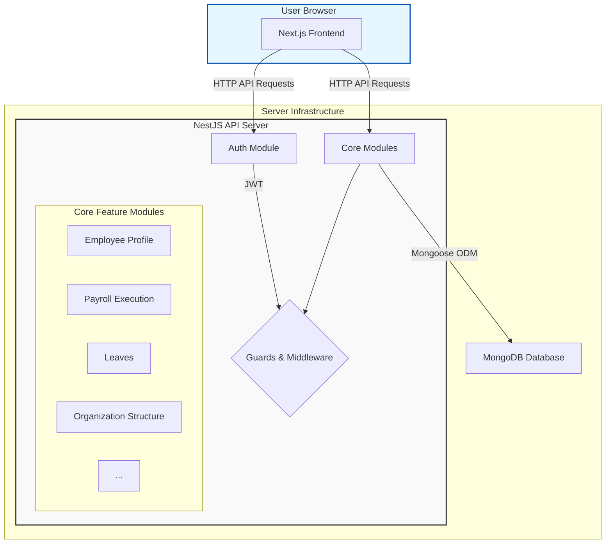
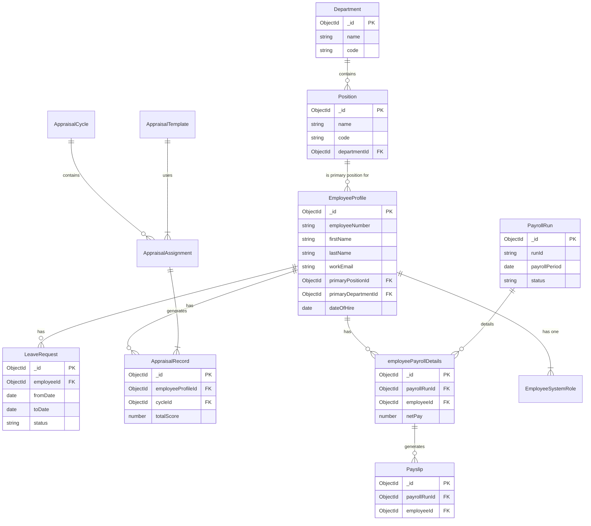

# HR Management System Documentation

This document provides a comprehensive overview of the full-stack HR Management System, built with a NestJS backend and a Next.js frontend. It covers architecture, API endpoints, database models, setup instructions, and core functionalities.

## 1. Project Overview

This is a comprehensive Human Resources (HR) management platform designed to handle various aspects of an employee's lifecycle within an organization. The system is split into two main parts: a powerful **NestJS backend** that serves as the core API and a modern **Next.js frontend** for the user interface.

Key functionalities include:

- **Authentication & Authorization**: Secure login and role-based access control.
- **Employee Profile Management**: Centralized repository for employee data.
- **Organization Structure**: Management of departments and positions.
- **Payroll Configuration & Execution**: Complex payroll setup, including allowances, pay grades, and payroll runs.
- **Payroll Tracking**: Tools for handling disputes, claims, and generating financial reports.
- **Leave & Time Management**: Systems for tracking leave, attendance, and shifts.
- **Recruitment & Performance**: Modules for managing job requisitions and performance appraisals.

### 1.1. Technology Stack | Area | Technology/Library | Purpose |

| :------ | :------------------------------------------------------------------------------ | :---------------------------------------------------------- |
| **Backend** | [NestJS](https://nestjs.com/) | A progressive Node.js framework for building the API server. |
| | [Mongoose](https://mongoosejs.com/) | An Object Data Modeling (ODM) library for MongoDB. |
| | [MongoDB](https://www.mongodb.com/) | The primary NoSQL database. |
| | [Passport.js](http://www.passportjs.org/) with JWT | Authentication and authorization strategy. |
| | `bcrypt` | Password hashing. |
| | `class-validator`, `class-transformer` | Data validation and transformation for API requests. |
| **Frontend**| [Next.js](https://nextjs.org/) | A React framework for building the user interface. |
| | [React](https://react.dev/) | The core UI library. |
| | [Tailwind CSS](https://tailwindcss.com/) | A utility-first CSS framework for styling. |
| | [Radix UI](https://www.radix-ui.com/) | A library of unstyled, accessible UI primitives. |
| | [Axios](https://axios-http.com/) | A promise-based HTTP client for making API requests. |
| | [Lucide React](https://lucide.dev/) | A library of simply beautiful icons. | ## 2. Quick Start & Setup

Follow these steps to get the development environment running locally.

### 2.1. Prerequisites

- [Node.js](https://nodejs.org/) (v18.x or later recommended)
- [MongoDB](https://www.mongodb.com/try/download/community) running on `localhost:27017` or a configured cloud instance.
- [npm](https://www.npmjs.com/) (or a compatible package manager like Yarn or pnpm)

### 2.2. Backend Setup

1.  **Navigate to the backend directory:**

    ```bash
    cd backend
    ```

2.  **Install dependencies:**

    ```bash
    npm install
    ```

3.  **Set up environment variables:**
    Create a `.env` file in the `backend` directory with the following variables:

    ```env
    # Connection string for your MongoDB instance
    MONGODB_URI=mongodb://localhost:27017/hr-main

    # Secret key for JWT signing
    JWT_SECRET=your-super-secret-key
    ```

4.  **Seed the database (Optional but Recommended):**
    The project includes scripts to populate the database with initial data.

    ```bash
    # This script seeds core organizational data
    npm run seed

    # This script seeds users and roles for authentication
    npm run seed:auth
    ```

5.  **Run the development server:**
    ```bash
    npm run start:dev
    ```
    The backend API will be available at `http://localhost:5000`.

### 2.3. Frontend Setup

1.  **Navigate to the frontend directory:**

    ```bash
    cd frontend
    ```

2.  **Install dependencies:**

    ```bash
    npm install
    ```

3.  **Set up environment variables:**
    Create a `.env.local` file in the `frontend` directory:

    ```env
    # URL of the running backend server
    NEXT_PUBLIC_API_URL=http://localhost:5000
    ```

4.  **Run the development server:**
    ```bash
    npm run dev
    ```
    The frontend application will be available at `http://localhost:3000`.

## 3. System Architecture

The application follows a classic client-server architecture, with a decoupled frontend and backend.

### 3.1. Architecture Diagram



### 3.2. Project Structure

The codebase is organized into two main directories: `backend` and `frontend`.

#### Backend (`/backend`)

The NestJS backend follows a modular architecture, where each primary feature is encapsulated in its own module.

```
/backend
├── src/
│   ├── auth/                  # Authentication, JWT strategy, roles guard
│   ├── employee-profile/      # Employee data models and services
│   ├── leaves/                # Leave requests and policies
│   ├── organization-structure/# Departments, positions, and hierarchy
│   ├── payroll-configuration/ # Pay grades, allowances, tax rules
│   ├── payroll-execution/     # Running payroll, generating payslips
│   ├── payroll-tracking/      # Disputes, claims, and reports
│   ├── performance/           # Performance appraisals
│   ├── time-management/       # Attendance, shifts, and holidays
│   ├── Common/                # Shared decorators, guards, etc.
│   ├── app.module.ts          # Root application module
│   └── main.ts                # Application entry point
├── scripts/
│   ├── seed.js                # Main database seeding script
│   └── auth-seed.js           # Seeds users and roles
└── package.json
```

#### Frontend (`/frontend`)

The Next.js frontend uses the App Router, with pages organized by routes and shared components in a dedicated directory.

```
/frontend
├── src/
│   ├── app/
│   │   ├── (auth)/            # Routes for authentication (login, etc.)
│   │   ├── (dashboard)/       # Main application routes with shared layout
│   │   │   ├── layout.tsx     # Dashboard layout with sidebar and header
│   │   │   └── page.tsx       # Main dashboard page
│   │   └── layout.tsx         # Root layout
│   ├── components/
│   │   ├── SideBar.tsx        # Main navigation sidebar
│   │   ├── Header.tsx         # Top header bar
│   │   └── ...                # Other reusable components
│   ├── context/
│   │   └── AuthContext.tsx    # Global state management for authentication
│   ├── hooks/
│   │   └── use-toast.ts       # Custom hook for notifications
│   └── lib/
│       └── payrollService.ts  # API service layer for payroll features
└── package.json
```

## 4. Database Schema

The system uses MongoDB as its database, with schemas defined using Mongoose. The following ER diagram illustrates the relationships between the core entities.



## 5. Core Modules & API Reference

This section details the core functionalities and their corresponding API endpoints. All protected endpoints require a valid JWT Bearer token in the `Authorization` header.

### 5.1. Authentication (`/auth`)

Handles user registration, login, and token generation.

#### `POST /auth/login`

Authenticates a user and returns a JWT access token.

**Request Body:**

```json
{
  "email": "john.doe@company.com",
  "password": "123456"
}
```

**Response (200 OK):**

```json
{
  "access_token": "eyJhbGciOiJIUzI1NiIsInR5cCI6IkpXVCJ9..."
}
```

**Possible Errors:**

- `401 Unauthorized`: Invalid email or password.

#### `POST /auth/register`

Registers a new employee profile.

**Request Body:**

```json
{
  "firstName": "Jane",
  "lastName": "Doe",
  "nationalId": "9876543210987",
  "personalEmail": "jane.doe.personal@gmail.com",
  "workEmail": "jane.doe@company.com",
  "password": "securepassword123"
}
```

**Response (201 Created):**

```json
{
  "_id": "60c72b2f9b1d8e001c8e4d1a",
  "firstName": "Jane",
  "lastName": "Doe",
  "workEmail": "jane.doe@company.com",
  "employeeNumber": "EMP-0021"
}
```

### 5.2. Leaves (`/leaves`)

Manages leave requests, balances, and policies.

#### `POST /leaves/requests`

Submits a new leave request for the authenticated employee.

**Authentication:** Required (JWT)

**Request Body:**

```json
{
  "leaveTypeId": "60c72b2f9b1d8e001c8e4d1b",
  "fromDate": "2025-08-10",
  "toDate": "2025-08-12",
  "justification": "Family vacation."
}
```

**Response (201 Created):**
The newly created leave request object.

#### `GET /leaves/requests/my-requests`

Retrieves all leave requests for the authenticated employee.

**Authentication:** Required (JWT)

**Query Parameters:**

- `status?`: `LeaveStatus` (e.g., 'PENDING', 'APPROVED') - Filters requests by status.
- `page?`: `number` - For pagination.
- `limit?`: `number` - For pagination.

**Response (200 OK):**

```json
{
  "requests": [
    /* array of leave request objects */
  ],
  "pagination": { "total": 20, "page": 1, "totalPages": 2 }
}
```

#### `GET /leaves/balance`

Retrieves the leave balance for the authenticated employee.

**Authentication:** Required (JWT)

**Query Parameters:**

- `leaveTypeId?`: `string` - If provided, returns the balance for a specific leave type.

**Response (200 OK):**
An array of leave balance objects for each leave type.

### 5.3. Organization Structure (`/organization-structure`)

Manages departments and positions.

#### `GET /organization-structure/departments`

Retrieves a list of all departments.

**Authentication:** Required (JWT)

**Response (200 OK):**

```json
[
  {
    "_id": "60c72b2f9b1d8e001c8e4d1c",
    "code": "ENG",
    "name": "Engineering",
    "active": true
  }
]
```

#### `GET /organization-structure/positions`

Retrieves a list of all positions.

**Authentication:** Required (JWT)

**Response (200 OK):**
An array of position objects.

## 6. Frontend Components

The frontend is built with reusable React components using Next.js and styled with Tailwind CSS.

### `ConditionalLayout.tsx`

**Location:** `frontend/src/components/ConditionalLayout.tsx`

**Purpose:** This is a key component that wraps the main application layout. It conditionally renders the `Sidebar` and `Header` for authenticated users on dashboard pages, while omitting them for public pages like `/login`. It also handles route protection by redirecting unauthenticated users.

**Usage:**
This component is used in the root `layout.tsx` to wrap all pages.

```tsx
// src/app/layout.tsx
export default function RootLayout({
  children,
}: {
  children: React.ReactNode;
}) {
  return (
    <html lang="en">
      <body>
        <AuthProvider>
          <ConditionalLayout>{children}</ConditionalLayout>
        </AuthProvider>
      </body>
    </html>
  );
}
```

### `AuthContext.tsx`

**Location:** `frontend/src/context/AuthContext.tsx`

**Purpose:** Provides global state management for authentication. It exposes the current user, authentication status, JWT token, and functions for `login` and `logout`.

**Key Exports:**

- **`AuthProvider`**: A React context provider that should wrap the entire application.
- **`useAuth()`**: A custom hook to access the authentication context from any component.

**Example Usage (`useAuth` hook):**

```typescript
import { useAuth } from "@/context/AuthContext";

function MyComponent() {
  const { user, isAuthenticated, logout } = useAuth();

  if (!isAuthenticated) {
    return <p>Please log in.</p>;
  }

  return (
    <div>
      <p>Welcome, {user?.firstName}!</p>
      <button onClick={logout}>Log Out</button>
    </div>
  );
}
```

## 7. Advanced Features

### Authentication & Authorization

The backend implements a robust authentication and role-based access control (RBAC) system.

- **Authentication Guard (`JwtAuthGuard`)**: Protects routes by verifying the JWT token sent in the `Authorization` header. It is applied globally or on a per-controller/per-route basis.
- **Roles Guard (`RolesGuard`)**: Works with the `Roles` decorator to restrict access to specific user roles. Roles are defined in `SystemRole` enum and stored in the `EmployeeSystemRole` collection.

**Example of a Protected Route with Role Check:**

```typescript
// src/leaves/leaves.controller.ts

@UseGuards(JwtAuthGuard, RolesGuard)
@Roles(SystemRole.HR_ADMIN) // Only HR Admins can access this
@Get('admin/requests')
async getAllLeaveRequestsForHR(...) {
  // ... handler logic
}
```

### Database Seeding

The project includes scripts to seed the database with initial data, making development and testing easier.

- **`scripts/seed.js`**: Populates core data like departments, positions, allowances, pay grades, and sample employee profiles. This is essential for a functional development environment.
- **`scripts/auth-seed.js`**: Specifically creates `EmployeeProfile` and `EmployeeSystemRole` documents for a set of predefined users with different roles (`PAYROLL_SPECIALIST`, `PAYROLL_MANAGER`, etc.), enabling immediate testing of the RBAC system.

To run the seeders:

```bash
# In the /backend directory

npm run seed
npm run seed:auth
```

## 8. Development & Testing

### Running Tests (Backend)

The backend uses Jest for unit and end-to-end testing.

- **Unit Tests**: Test individual services and controllers in isolation.
- **E2E Tests**: Test the full application flow by making HTTP requests to the running application instance.

**Commands:**

```bash
# Run unit tests

npm run test


# Run e2e tests

npm run test:e2e


# Run tests with coverage report

npm run test:cov
```
